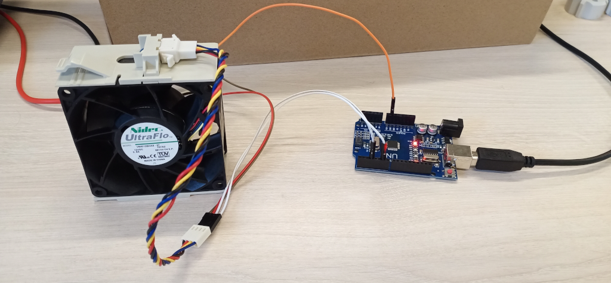
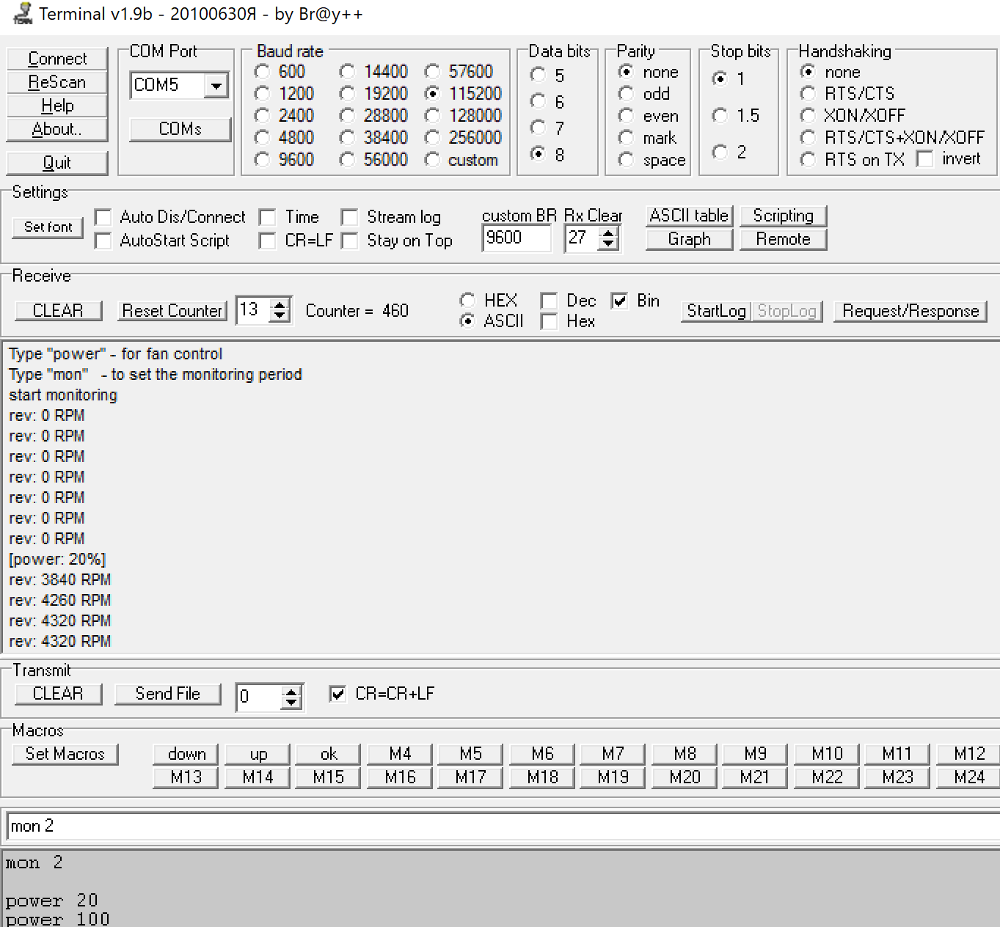
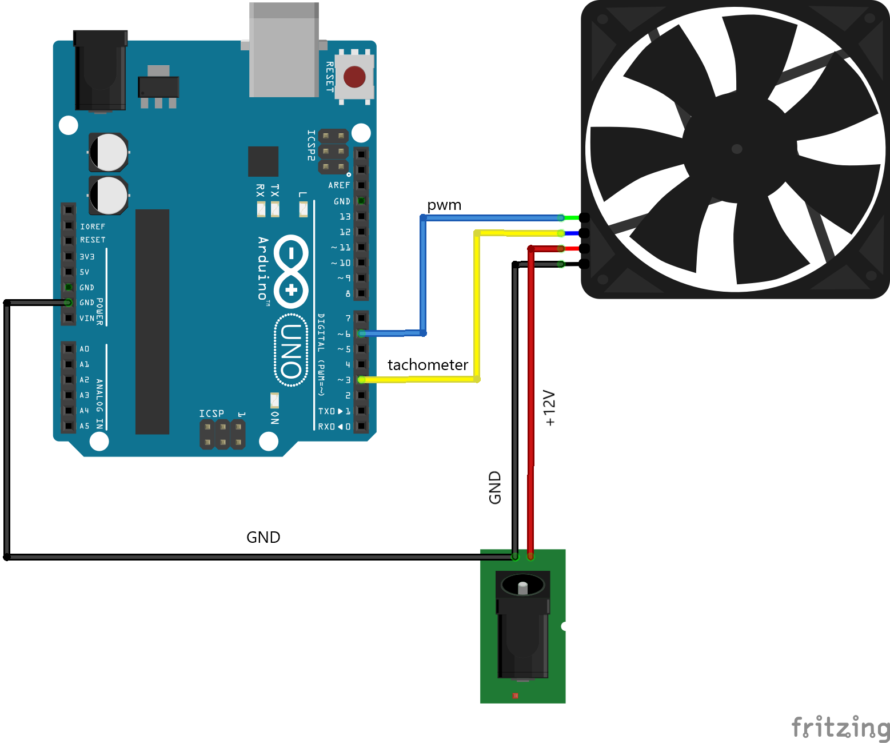

## Управление вентиляторами с микроконтроллера Atmega328

Устройство реализовано на базе платы **Arduino uno**.

Для управления вентиляторами комманды передаются через СОМ-порт (стандартный интерфейс, распаянный на плате). Скорость 115200 8n1.

Команды: "power", "mon".
Пример использования команд:
power 20 (устанавливает мощность 20%). 
power 0 (выключить вентилятор). 
mon 3 (мониторинг RPM каждые 3 секунды) 
mon 0 (выключить мониторинг) 

